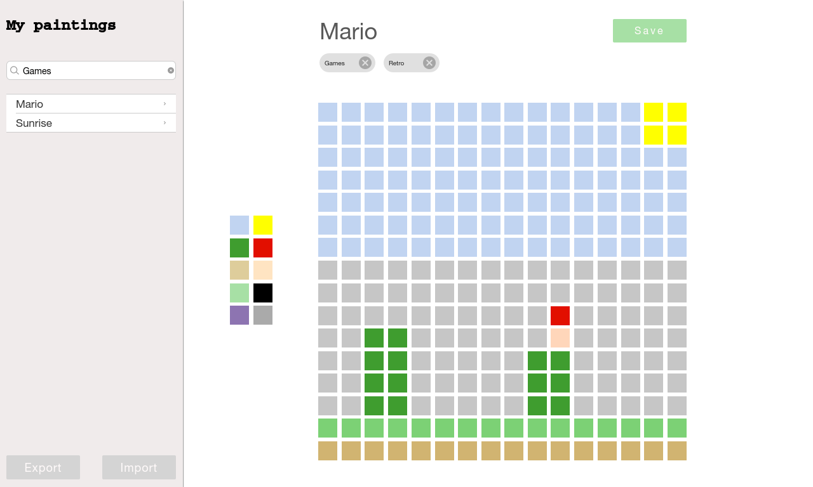

# React/Redux

## Painting editor

### Features

1. Painting board
    - The painting is a **16x16** pixel
    - **undo/redo**
2. Create, read, update and delete paintings (in browser memory)
    - Can name them
    - Can tag them
    - Can search/filter them
3. Can se a preset of **10 colors**
4. Can export/import a painting

### Wireframe

### Instructions:
 - Use Git for version control
 - Use React + Redux + Webpack + ... (no create-react-app and similar solutions)
 - The UI/UX is up to you
 - Should work on Chrome

### Score:
* Code quality
* Project architecture
* Features
* Modularity
* UI/UX
* Time management `It's ok not to finish **all** the features`
  
